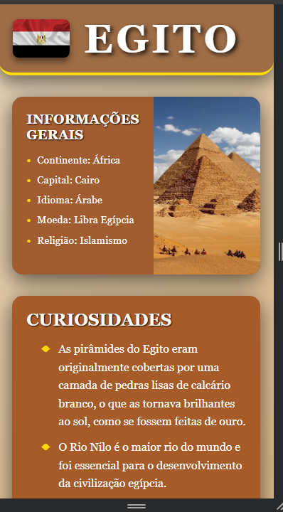
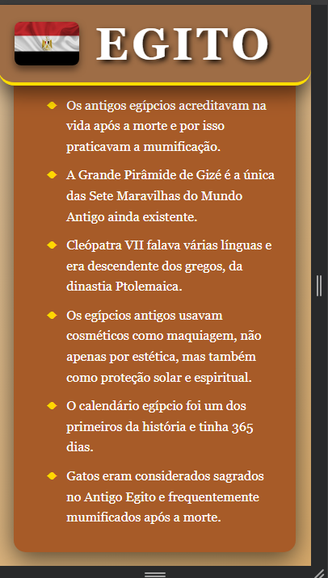
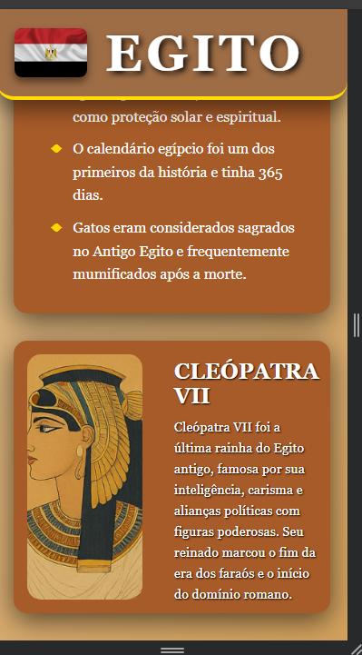

World Explore 

Bem vindo ao World Explore app, este aplicativo foi desenvolvido pelos alunos: Ana Clara, Nicolly Pruchak, Mateus Evandro, Natanael Przybysz e Gustavo Alves.

O World Explore app é um aplicativo criado para gerar informações sobre os países do mundo, assim como o nome é autoexplicativo, basicamente iremos explorar o mundo em um aplicativo, cada integrante da equipe criou uma tela de cada país que mais chama sua atenção, nesta tela, estão informações básicas e/ou curiosidades, feriados, comida típica ou algo interessante sobre a nação escolhida.

Os países escolhidos para nosso app foram os:
- Brasil - Mateus
- Egito - Nicolly
- EUA - Ana Clara
- Reino Unido - Gustavo
- Alemanha - Natanael 

A página inicial do app, no caso sua home, concluída pela Ana Clara, é uma página que contém o cadastro do usuário (E-mail e senha), uma navbar responsiva que te leva as outras telas do aplicativo, referenciado pelo nome de cada país, e para a página Lista de países e o footer.

A Lista de Países é uma das abas príncipais do app, efito por Ana Clara, ela abrange um breve resumo sobre cada país incluido no aplicativo, resaltando sua história e persuadindo o usuário a ver o app do início ao fim, além disso, cada nação está referenciada com a sua devida bandeira, como nos prints abaixo:

A página Brasil, concluída pelo aluno Mateus, contém a capital, a bandeira, a população e a moeda, com um extra, sobre o atual presidente nacional. Assim como nas imagens mostradas a baixo:

A página sobre o Egito, desenvolvida por Nicolly, apresenta informações como capital, população, moeda e curiosidades culturais.  
O design foi inspirado na estética egípcia, com elementos visuais que ajudam na imersão do usuário.  

Abaixo, seguem algumas imagens da tela criada:

  
  
  

A aba sobre o Estados Unidos da América, feita pela Ana Clara, descreve um pouco sobre a capital, a bandeira, a população e a moeda, assim como na prototipação. Assim como as imagens a seguir:

A página do Reino Unido, concluída pelo aluno Guatavo, contém a capital, a bandeira, a população e a moeda, com um extra, sobre as bandas nacionais. Assim como nas imagens mostradas a baixo:

A página sobre a Alemanha, feita pelo Natanael, descreve um pouco sobre a capital, a bandeira, a população e a moeda, assim como no figma. Assim como as imagens a seguir:

  
  
  
  
  
  
  
  
  
  
  
  
  
  

Por fim, este é o trabalho desenvolvido pelo grupo 4 sobre países ao redor do mundo, com várias curiosidades e características marcantes sobre cada nacionalidade!

